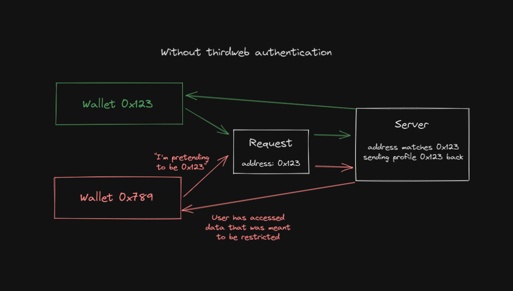
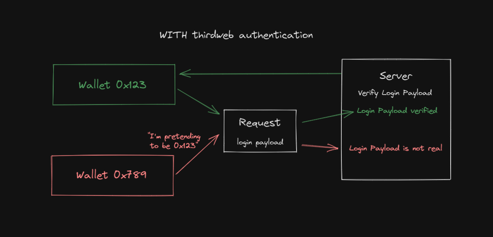

## Getting Started

Create a project using this example:

```bash
npx thirdweb create --authentication-restricted-content
```

## How It Works

This template uses our [authentication SDK](https://portal.thirdweb.com/building-web3-apps/authenticating-users) to serve restricted content
to users who have permission on the server side.

### Sign In

When the user clicks the `Request Access` button, they are prompted to sign a message on the client-side, which uses the SDK to generate a login payload.

```jsx
// Generate a signed login payload for the connected wallet to authenticate with
const loginPayload = await sdk.auth.login(domain);
```

### Request Restricted Content

This payload is sent along with a request for restricted data on the server side.

```jsx
// Make api request to server and send the login payload in the body
const response = await fetch(`/api/get-restricted-content`, {
  method: "POST",
  body: JSON.stringify({
    loginPayload,
  }),
});
```

### Verify User On the Server

On the server-side, we verify that the user is who they claim to be:

```jsx
// Get the login payload that we sent with the request
const { loginPayload } = JSON.parse(req.body);

const sdk = new ThirdwebSDK("mumbai");
const domain = "thirdweb.com";

// Use that login payload to verify the user
const verified = sdk.auth.verify(domain, loginPayload);
```

This gives us a way to verify the connected wallet on the server-side.

### Why Is This Important?

Let's look at an example _without_ using the authentication SDK.

You could restrict access to content based on the wallet address that gets passed in as a `string` to the server-side. And when you make requests to the server, you could pass the connected wallet address in the request body.

For example, you might have an off-chain database that stores user profile information. You could say `if (user.address === walletAddress) { return userProfile }` to get the user profile and only allow the connected wallet to access it.

The security concern here is that users can make API requests with **any** value for that wallet address, meaning they can pretend to be another user/wallet. For example, if I try to access your profile, I could pass in your wallet address rather than mine in the request body, and see your profile!



With authentication, you can only access content that you have permission to access, since the login payload is verified on the server-side.



## Join our Discord!

For any questions, suggestions, join our discord at [https://discord.gg/thirdweb](https://discord.gg/thirdweb).
